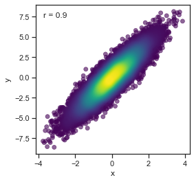

======
gpplot
======

.. image:: https://img.shields.io/pypi/v/gpplot.svg
        :target: https://pypi.python.org/pypi/gpplot

.. image:: https://img.shields.io/travis/gpp-rnd/gpplot.svg
        :target: https://travis-ci.com/gpp-rnd/gpplot

.. image:: https://readthedocs.org/projects/gpplot/badge/?version=latest
        :target: https://gpplot.readthedocs.io/en/latest/?badge=latest
        :alt: Documentation Status

Introduction
------------

Plotting functions for the Genetic Perturbation Platform's R&D group at the Broad Institute.
Extends matplotlib and seaborn functionality with extra plot types. Includes functions for easy
styling and consistent color palettes.

* Free software: MIT license
* Documentation: https://gpplot.readthedocs.io.

Tutorial
--------

To install gpplot, run this command in your terminal::

    $ pip install gpplot

Import packages::

    import seaborn as sns
    import pandas as pd
    import numpy as np
    import matplotlib.pyplot as plt
    import gpplot

Set aesthetics for all plots using gpplot defaults::

    gpplot.set_aesthetics()

Setup data::

    nsamps = 20000
    scatter_data = pd.DataFrame({'x': np.random.normal(size = nsamps)}, index = range(nsamps))
    scatter_data['y'] = 2*scatter_data['x'] + np.random.normal(size = nsamps)

Create a point density plot and add a pearson correlation::

    fig, ax = plt.subplots(figsize = (4,4))
    ax = gpplot.point_densityplot(scatter_data, 'x', 'y', palette=gpplot.sequential_cmap())
    ax = gpplot.add_correlation(ax, scatter_data, 'x', 'y')

Label points in a scatterplot::

    fig, ax = plt.subplots(figsize = (4,4))
    mpg = sns.load_dataset('mpg')
    ax = sns.scatterplot(data = mpg, x = 'weight', y = 'mpg', ax = ax)
    label = ['hi 1200d', 'ford f250', 'chevy c20', 'oldsmobile omega']
    gpplot.label_points(ax, mpg, 'weight', 'mpg', label, 'name',
                        size = 12, style = 'italic')

TODO
----

Credits
-------

This package was created with Cookiecutter_ and the `audreyr/cookiecutter-pypackage`_ project template.

.. _Cookiecutter: https://github.com/audreyr/cookiecutter
.. _`audreyr/cookiecutter-pypackage`: https://github.com/audreyr/cookiecutter-pypackage
